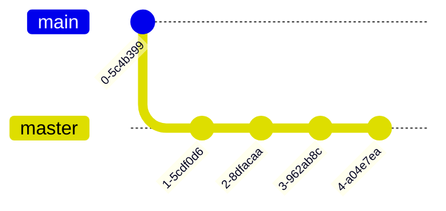

# Hola mundo

## Esto es un subtitulo

```c++
template<typename Object>
typename SLList<Object>::iterator SLList<Object>::erase(iterator itr) {
    if (itr == end())
        throw std::logic_error("Cannot erase at end iterator");
    Node *p = head;
    while (p->next != itr.current) p = p->next;
    Node *toDelete = itr.current;
    p->next = itr.current->next;
    delete toDelete;
    theSize--;
    return iterator(p->next);
}

```

Este bloque de código se dedica a **eliminar** los datos del iterador en cuestión para una lista enlazada sencilla utilizando los punteros para recorrer la lista y eliminar el nodo que se desea.

## Esto es otro subtitulo

```c++
template<typename Object>
void SLList<Object>::print() {
    iterator itr = begin();
    while (itr != end()) {
        std::cout << *itr << " ";
        ++itr;
    }
    std::cout << std::endl;
}
```

Este siguiente bloque de código se dedica a **imprimir** los datos de la lista enlazada sencilla utilizando el iterador para recorrer la lista e imprimir los datos de cada nodo.


Puedes buscar la imagen en el siguiente [link](https://www.google.com/)


